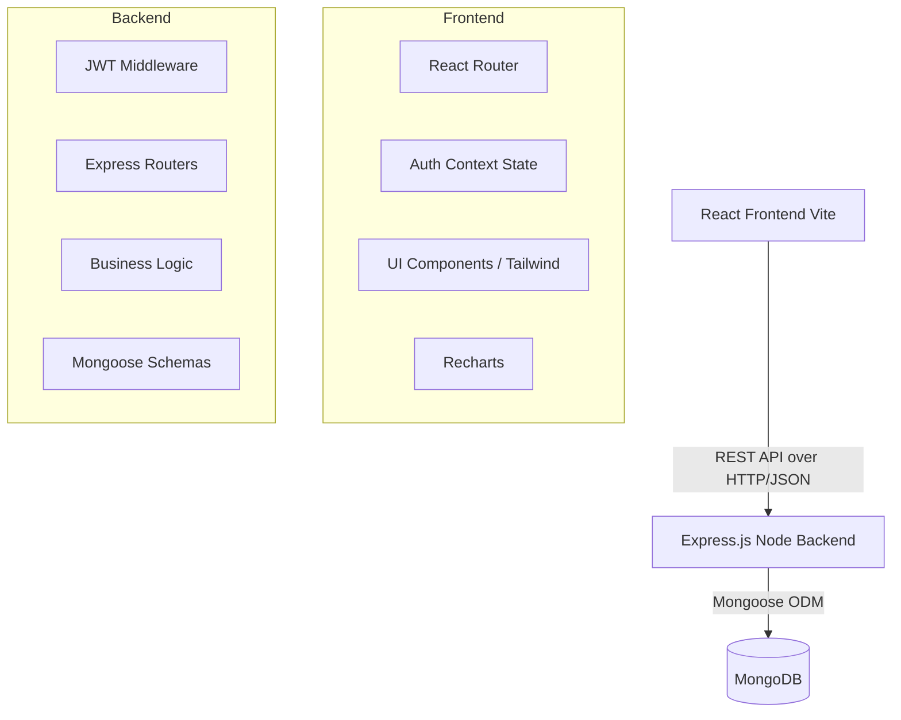
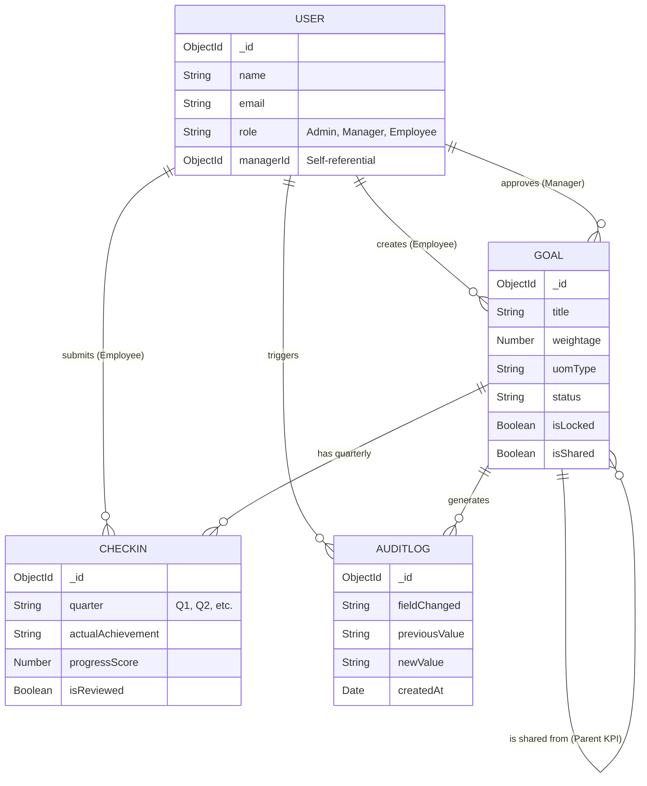

# System Architecture & Design

This document provides a high-level overview of the architecture and technical design choices for the **GoalTrack Portal** (AtomQuest Hackathon Submission).

---

## 🏗️ High-Level Architecture

The application follows a standard **Client-Server (3-Tier) Architecture** utilizing the MERN stack.

### 1. Presentation Tier (Frontend)
* **Framework**: React.js bundled via Vite for extremely fast Hot-Module Replacement (HMR) during development and highly optimized production builds.
* **Styling**: Tailwind CSS v4. Used exclusively for utility-first styling, ensuring zero custom CSS payload and a consistent, responsive design system.
* **State Management**: React Context API (`AuthContext`) manages global user sessions, avoiding the boilerplate of Redux for a lean application.
* **Routing**: `react-router-dom` utilizing a `<ProtectedRoute>` wrapper to strictly enforce Role-Based Access Control (RBAC) on the client side before rendering sensitive views.

### 2. Application Tier (Backend)
* **Framework**: Node.js with Express.js.
* **Authentication**: JSON Web Tokens (JWT). Tokens are generated upon login and passed in the `Authorization: Bearer` header.
* **Middleware**: 
  * `protect`: Verifies JWT validity and attaches the user document to the request.
  * `authorize(...roles)`: Checks if the attached user possesses the required clearance (e.g., Admin, Manager) before allowing route execution.
* **Modularity**: Routes are separated by domain logic (`/api/auth`, `/api/goals`, `/api/checkins`, `/api/admin`).

### 3. Data Tier (Database)
* **Database**: MongoDB. Chosen for its flexible document model, which is ideal for storing varied Goal structures (varying Units of Measurement and string-based vs numeric targets).
* **ODM**: Mongoose enforces schema validation at the application level and provides powerful populate (join) capabilities to link Goals to Users and Check-ins.

---

## 🗄️ Database Schema Relationships

The data model is heavily relational, utilizing MongoDB `ObjectIds` to link documents.

---

## ⚙️ Key Technical Implementations

### 1. Goal Validation Engine
When an employee submits a goal sheet via bulk `POST /api/goals`, the backend loops through the array in memory to sum the weightages. It immediately rejects the payload with a `400 Bad Request` if the sum is not exactly `100%`, ensuring database integrity without saving partial goal sheets.

### 2. Shared Goal Synchronization
To solve the "Shared KPI" requirement, when a Manager pushes a goal, the system creates cloned `Goal` documents for each team member flagged with `isShared: true`. When an employee updates their `Checkin` for a shared goal, the backend intercepts the request, queries all sibling goals with the same title/manager, and seamlessly updates the check-in data across all records in a single loop.

### 3. Audit Compliance
The `createAuditLog` utility is deeply integrated into the `PUT /api/goals/:id/review` route. Whenever a Manager or Admin updates a locked goal's `target`, `weightage`, or `status`, the system captures the old value vs. the new value and writes an immutable record to the `AuditLog` collection, which is then rendered on the Admin Dashboard.

### 4. Cost & Performance Optimization
* **Thin Client**: The frontend leverages calculated properties heavily. For example, the overall Progress Score on the dashboard is calculated dynamically on the client side by pulling existing check-ins, eliminating the need for expensive, repetitive server-side aggregation pipelines.
* **Caching Strategy**: API responses are lightweight JSON. In a production environment, MongoDB indexes on `employeeId` and `managerId` ensure query times remain consistently low.
